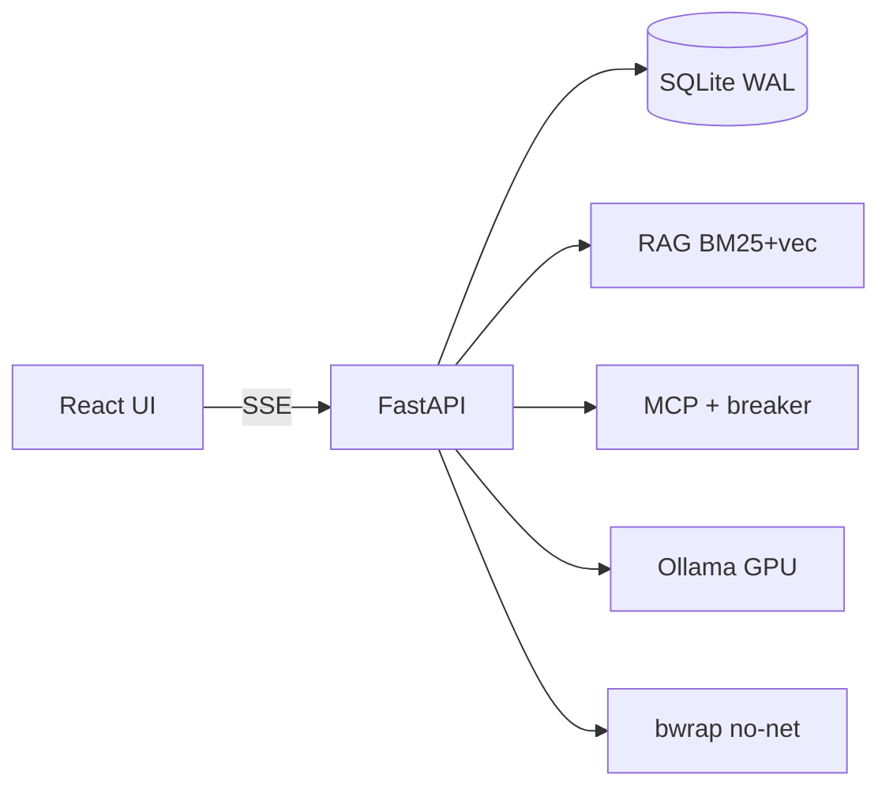

# OtterCode Neo

Agente de código **local** con Ollama: lee el repo, parchea, corre tests. FastAPI + React. Un coder por defecto (modo chat); la cadena de agentes es opcional.

Licencia: [MIT](LICENSE).



## Quickstart

```bash
bash install.sh
# o a mano:
python -m venv .venv && source .venv/bin/activate
pip install -e .
npm install
npm run build
```

Ollama en `127.0.0.1:11434`. Arranque:

```bash
.venv/bin/python -m uvicorn backend:app --host 127.0.0.1 --port 8000
```

Abre `http://127.0.0.1:8000`.

## Terminal (CLI / TUI)

Mismo core que la web. Ver [docs/cli.md](docs/cli.md).

```bash
pip install -e .
ottercode chat
ottercode learn python
ottercode edit src/app.py
```

## Variables de entorno (backend)

| Variable | Default | Significado |
| --- | --- | --- |
| `OTTERCODE_LLM_BACKEND` | `ollama` | Transporte: `ollama` o `openai` |
| `OTTERCODE_OLLAMA` | `http://127.0.0.1:11434` | Daemon Ollama |
| `OTTERCODE_HOST` | `127.0.0.1` | Bind HTTP |
| `OTTERCODE_PORT` | `8000` | Puerto HTTP |
| `OTTERCODE_MODEL` | `qwen2.5-coder:7b` | Coder por defecto (si no está, primer modelo de `/api/tags`) |
| `OTTERCODE_API` | deprecado | Si vale `ollama`/`openai`, fallback de `OTTERCODE_LLM_BACKEND`. Si parece URL, se ignora. |
| `OTTERCODE_NUM_CTX` | `32768` | Contexto (FLASH_ATTENTION + KV q8_0 en 8 GB) |
| `OTTERCODE_NUM_PREDICT` | `4096` | Tope de generación |
| `OTTERCODE_KEEP_ALIVE` | `15m` | KV del coder en VRAM |
| `OTTERCODE_ASK_PERMISSIONS` | `1` | Confirmar tools peligrosas |
| `OTTERCODE_SANDBOX_REQUIRED` | `1` | Fail-closed sin bwrap. Selftest/CI: `=0` |
| `OTTERCODE_NATIVE_TOOLS` | `auto` | `on` / `off` / `auto` |
| `OTTERCODE_MAX_TOOL_STEPS` | `60` | Skills por turno |
| `OTTERCODE_FLUSH_EVERY_TURN` | `0` | Flush solo al cambiar de modelo |
| `OTTERCODE_TOKEN` | — | Auth `X-Otter-Token` |

## Variables de entorno de Ollama (daemon, no el backend)

Exportarlas **en el proceso de `ollama serve`** y reiniciar Ollama.

| Variable | Valor | Efecto |
| --- | --- | --- |
| `OLLAMA_FLASH_ATTENTION` | `1` | Menos VRAM |
| `OLLAMA_KV_CACHE_TYPE` | `q8_0` | KV cuantizado |
| `OLLAMA_MAX_LOADED_MODELS` | `1` | Un modelo (8 GB) |
| `OLLAMA_NUM_PARALLEL` | `1` | Sin lotes concurrentes |

```bash
export OLLAMA_FLASH_ATTENTION=1
export OLLAMA_KV_CACHE_TYPE=q8_0
export OLLAMA_MAX_LOADED_MODELS=1
export OLLAMA_NUM_PARALLEL=1
ollama serve
```

## Testing

```bash
OTTERCODE_ASK_PERMISSIONS=0 OTTERCODE_SANDBOX_REQUIRED=0 python dev/selftest.py
npm run lint
npm run build
```
